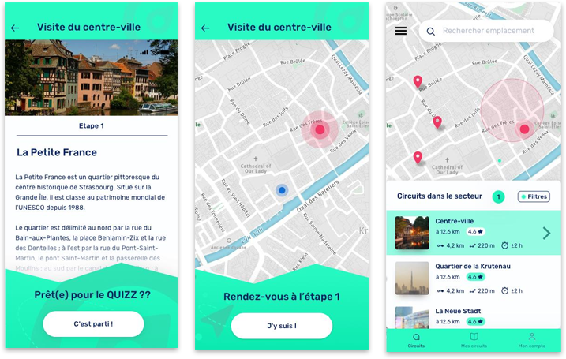

## Cirquizz 🗺️📍 React Native 📱  
  

    
    

  

## Languages and Tools  

      

### [EN] Cirquizz ?

**Cirquizz** is a **mobile orienteering app** where you have to answer questions to get to the next step of a circuit to discover a city.

- Authentication 🔐
- Consult on a map the circuits near me 🗺️
- Choose a circuit and start playing
- Checking with the geolocation of its position towards a stage of the circuit
- Different types of movement towards the point 
    - Hot/cold gauge -- near/far 🌡️
    - Compass 🧭
    - Point on map 📍
    - Description of the next point 📄

This application was developed to validate my **professional degree** in **"Web and Mobile Development"**.
We worked in a team of 5 on this project (2 mobile developers, 2 web developers, 1 designer and project manager).

### [FR] Cirquizz ?

**Cirquizz** est une **application mobile de course d'orientation** où il faut répondre à des questions pour accéder à la prochaine étape d'un circuit afin de découvrir une ville.

- Authentification 🔐
- Consulter sur une carte les circuits proche de moi 🗺️
- Choisir un circuit et commencer à jouer
- Vérification avec la géolocalisation de sa position vis-à-vis d'une étape du circuit
- Différents types de déplacement vers le point 
    - Jauge chaud/froid -- proche/loin 🌡️
    - Boussole 🧭
    - Point sur la carte 📍
    - Description du prochain point 📄

Cette application a été développée pour valider ma **licence professionnelle** en **"Développement d'applications web et mobile"**.
Nous avons travaillé en équipe de 5 sur ce projet (2 développeurs mobile, 2 développeurs web, 1 designer et chef de projet).

